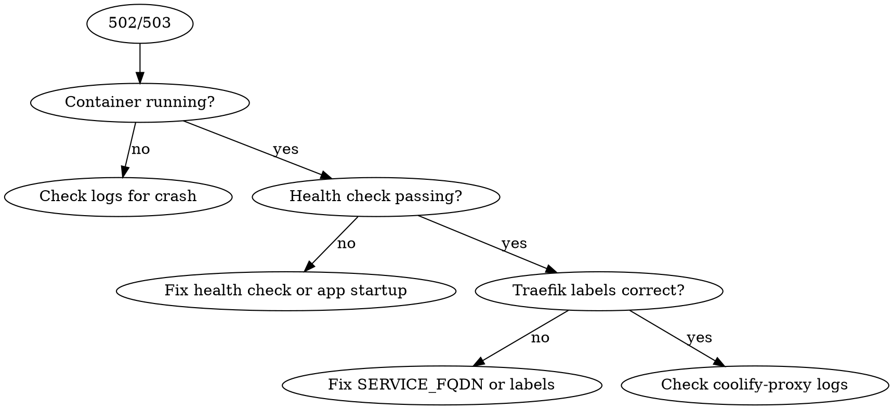

# Coolify v4 — Deploy, Debug & Adapt

## Overview

Coolify v4 is a self-hosted PaaS with Traefik reverse proxy. Services run as Docker containers managed by Coolify. This skill covers adapting Docker Compose for Coolify, debugging running services via SSH, and setting up new deployments.

## Core Architecture

```
Internet → Traefik (coolify-proxy :80/:443) → Docker containers (coolify network)
                                              ↑
                              Coolify manages labels, networks, SSL
```

- **Proxy:** Traefik v3, container `coolify-proxy`, network `coolify` (external)
- **Data:** `/data/coolify/` on the server
- **Proxy config:** `/data/coolify/proxy/dynamic/`
- **SSH access:** Available for direct `docker` commands

## Adapting Docker Compose for Coolify

### The Golden Rules

| Rule | Why |
|------|-----|
| **No `ports:` section** | Coolify's Traefik handles all routing |
| **No `networks:` definition** | Coolify auto-connects to `coolify` network |
| **Use `SERVICE_FQDN_*` env vars** | Tells Coolify which service gets a domain |
| **Use `SERVICE_PASSWORD_*` for secrets** | Coolify auto-generates and injects them |
| **Named volumes, no bind mounts** | Coolify manages volume lifecycle |
| **Add health checks** | Coolify uses them to track service status |

### Magic Environment Variables

Coolify parses special env var prefixes and auto-configures Traefik routing, passwords, and URLs:

```yaml
environment:
  # Generate FQDN, proxy default port (first EXPOSE in image)
  - SERVICE_FQDN_MYAPP

  # Proxy to specific port
  - SERVICE_FQDN_MYAPP_3000

  # Proxy with path prefix to specific port
  - SERVICE_FQDN_API_8080=/api

  # Auto-generated password (reusable across services)
  - DB_PASSWORD=${SERVICE_PASSWORD_POSTGRES}

  # 64-char password
  - SECRET_KEY=${SERVICE_PASSWORD_64_APPKEY}

  # Auto-generated username
  - DB_USER=${SERVICE_USER_POSTGRES}
```

**Naming rule:** Identifiers with underscores (`_`) cannot use ports. Use hyphens (`-`) instead: `SERVICE_FQDN_MY-APP_3000` works, `SERVICE_FQDN_MY_APP_3000` breaks.

### Before/After Example

**Original (standalone Docker Compose):**
```yaml
version: '3.8'
services:
  app:
    image: myapp:latest
    ports:
      - "3000:3000"
    environment:
      - DATABASE_URL=postgres://user:pass@db:5432/mydb
    depends_on:
      - db
    networks:
      - backend

  db:
    image: postgres:16
    ports:
      - "5432:5432"
    environment:
      - POSTGRES_USER=user
      - POSTGRES_PASSWORD=pass
      - POSTGRES_DB=mydb
    volumes:
      - ./data:/var/lib/postgresql/data
    networks:
      - backend

networks:
  backend:
```

**Adapted for Coolify:**
```yaml
services:
  app:
    image: myapp:latest
    environment:
      - SERVICE_FQDN_APP_3000
      - DATABASE_URL=postgres://${SERVICE_USER_POSTGRES}:${SERVICE_PASSWORD_POSTGRES}@db:5432/${POSTGRES_DB:-mydb}
    depends_on:
      db:
        condition: service_healthy
    healthcheck:
      test: ["CMD", "curl", "-f", "http://localhost:3000/health"]
      interval: 10s
      timeout: 5s
      retries: 3

  db:
    image: postgres:16
    environment:
      - POSTGRES_USER=${SERVICE_USER_POSTGRES}
      - POSTGRES_PASSWORD=${SERVICE_PASSWORD_POSTGRES}
      - POSTGRES_DB=${POSTGRES_DB:-mydb}
    volumes:
      - pg-data:/var/lib/postgresql/data
    healthcheck:
      test: ["CMD-SHELL", "pg_isready -U $${POSTGRES_USER} -d $${POSTGRES_DB}"]
      interval: 5s
      timeout: 5s
      retries: 10
```

**What changed:**
1. Removed all `ports:` — Traefik routes via `SERVICE_FQDN_APP_3000`
2. Removed `networks:` — Coolify handles it
3. Replaced hardcoded credentials with `SERVICE_PASSWORD_*` / `SERVICE_USER_*`
4. Changed bind mount (`./data`) to named volume (`pg-data`)
5. Added health checks for both services
6. Removed `version:` (deprecated in modern Compose)

### Traefik Labels (Advanced)

Only needed for custom routing beyond what `SERVICE_FQDN_*` provides:

```yaml
labels:
  - traefik.enable=true
  - "traefik.http.routers.myapp.rule=Host(`app.example.com`) && PathPrefix(`/`)"
  - traefik.http.routers.myapp.entryPoints=https
  - traefik.http.routers.myapp.tls.certresolver=letsencrypt
  - traefik.http.services.myapp.loadbalancer.server.port=3000
```

## Debugging Coolify Services

### Quick Diagnosis (via SSH)

```bash
# 1. Check if container is running
ssh user@server docker ps --filter "name=<service>" --format "{{.Names}} {{.Status}}"

# 2. Check logs (last 100 lines)
ssh user@server docker logs --tail 100 <container_name>

# 3. Check if container can reach other services
ssh user@server docker exec <container> ping -c 1 <other_service_name>

# 4. Check Traefik proxy logs
ssh user@server docker logs --tail 50 coolify-proxy

# 5. Check network connectivity
ssh user@server docker network inspect coolify --format '{{range .Containers}}{{.Name}} {{end}}'

# 6. Inspect container config
ssh user@server docker inspect <container> --format '{{json .Config.Env}}' | python3 -m json.tool

# 7. Check resource usage
ssh user@server docker stats --no-stream --format "table {{.Name}}\t{{.CPUPerc}}\t{{.MemUsage}}" | grep <service>
```

### Common Problems & Fixes

#### Service not reachable (502/503)



**Typical causes:**
- App listens on `127.0.0.1` instead of `0.0.0.0` → fix in app config
- Wrong port in `SERVICE_FQDN_*_<PORT>` → must match app's listen port
- Health check fails → container seen as unhealthy, Traefik skips it
- Container not on `coolify` network → redeploy from Coolify UI

#### Container keeps restarting

```bash
# Check exit code
ssh user@server docker inspect <container> --format '{{.State.ExitCode}} {{.State.Error}}'

# Check OOM kills
ssh user@server docker inspect <container> --format '{{.State.OOMKilled}}'

# Check last logs before crash
ssh user@server docker logs --tail 50 <container> 2>&1
```

**Common causes:**
- OOM killed → increase memory limit in Coolify UI
- Missing env vars → check `SERVICE_PASSWORD_*` references
- Volume permissions → container user can't write to mounted volume
- Dependency not ready → add `depends_on` with `condition: service_healthy`

#### Service-to-service communication fails

Services in the same Coolify project communicate via **container name**, not localhost or external domain:

```yaml
# In app service:
environment:
  - DATABASE_URL=postgres://user:pass@db:5432/mydb     # "db" = service name
  - REDIS_URL=redis://redis:6379                        # "redis" = service name
```

If services are in **different Coolify projects**, they need to be on the same Docker network. Use `connect_to_docker_network` in Coolify settings or add to the `coolify` network manually.

#### SSL/Domain issues

```bash
# Check Traefik certificate
ssh user@server cat /data/coolify/proxy/acme.json | python3 -c "
import json, sys
data = json.load(sys.stdin)
for resolver in data:
    certs = data[resolver].get('Certificates', [])
    for c in certs:
        domain = c.get('domain', {})
        print(domain.get('main', ''), domain.get('sans', []))
"

# Check Traefik dynamic config
ssh user@server ls /data/coolify/proxy/dynamic/

# Force SSL renewal — restart proxy
ssh user@server docker restart coolify-proxy
```

#### Persistent storage issues

```bash
# Find where volume is mounted on host
ssh user@server docker volume inspect <volume_name> --format '{{.Mountpoint}}'

# Check volume size
ssh user@server du -sh $(docker volume inspect <volume_name> --format '{{.Mountpoint}}')

# Backup volume
ssh user@server "docker run --rm -v <volume_name>:/data -v /tmp:/backup alpine tar czf /backup/volume-backup.tar.gz -C /data ."
```

## Setting Up New Services

### Via Coolify UI (Recommended)

1. Project → Add Resource → Docker Compose
2. Paste adapted `docker-compose.yml`
3. Set environment variables in Coolify UI (overrides file values)
4. Configure domain under "Domain" tab
5. Deploy

### Via Coolify API

```bash
# List projects
curl -s -H "Authorization: Bearer $COOLIFY_TOKEN" \
  https://coolify.example.com/api/v1/projects | jq '.[] | {uuid, name}'

# Deploy application
curl -X POST -H "Authorization: Bearer $COOLIFY_TOKEN" \
  -H "Content-Type: application/json" \
  https://coolify.example.com/api/v1/applications/public \
  -d '{
    "project_uuid": "...",
    "server_uuid": "...",
    "environment_name": "production",
    "name": "my-app",
    "git_repository": "https://github.com/org/repo",
    "git_branch": "main",
    "build_pack": "dockerfile",
    "ports_exposes": "3000",
    "domains": "app.example.com",
    "is_force_https_enabled": true,
    "instant_deploy": true
  }'
```

## Checklist: Docker Compose Coolify-Ready

When reviewing or creating a Docker Compose file for Coolify, verify:

- [ ] No `ports:` sections (unless intentionally exposing non-HTTP like UDP/MQTT)
- [ ] No custom `networks:` definition
- [ ] No `version:` key
- [ ] Primary service has `SERVICE_FQDN_<NAME>` or `SERVICE_FQDN_<NAME>_<PORT>`
- [ ] Passwords use `${SERVICE_PASSWORD_*}` not hardcoded values
- [ ] Volumes are named, not bind mounts (`pg-data:/...` not `./data:/...`)
- [ ] Health checks on all services
- [ ] `depends_on` with `condition: service_healthy` where needed
- [ ] App listens on `0.0.0.0`, not `127.0.0.1`
- [ ] Inter-service communication uses container names, not `localhost`

## Don'ts

- Don't add `ports:` for HTTP services — Traefik handles it
- Don't hardcode passwords in compose files — use Coolify magic vars
- Don't use bind mounts — Coolify can't manage them across deploys
- Don't configure SSL manually — Coolify + Traefik handle Let's Encrypt
- Don't restart containers with `docker restart` — use Coolify UI/API (otherwise Coolify loses track)
- Don't edit files in `/data/coolify/` directly unless you know what you're doing
